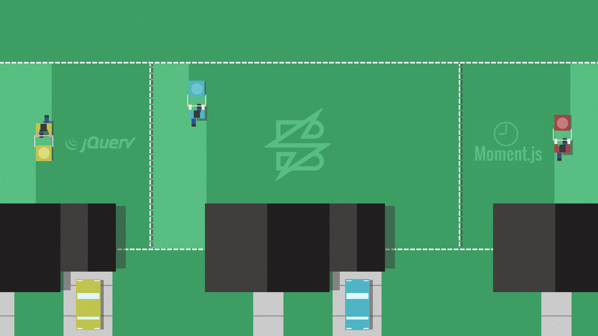

<!-- .slide: class="dark" data-background="#1e1e1e" -->

# Testing Boundaries


```javascript
const React = require('react');
export default class ShoppingCart extends React.Component {
  constructor(props) {
    super(props);
    this.state = {};
    this.addItem = this.addItem.bind(this);
  }

  addItem(item) {
    this.setState({ item });
  }

  render() {
    <button onClick={this.addItem('thing')}>Buy Me!</button>;
  }
}
```


```javascript
addItem(item) {
  const available = this.props.checkStock(item);

  if (available > 0) {
    this.setState({ item });
  } else {
    this.props.notify('Sorry, that item is out of stock');
  }
}
```


## Mow Your Own Yard


[https://seesparkbox.com/foundry/mow_your_own_yard](https://seesparkbox.com/foundry/mow_your_own_yard)


## Mock `checkStock`

```javascript
it('adds item to the cart if available', () => {
  const inStock = () => 80;

  const wrapper = shallow(<ShoppingCart checkStock={inStock} />);
  const instance = wrapper.instance();
  instance.addItem('Build Right: Front End Testing');

  expect(wrapper.state('item')).to.equal('Build Right: Front End Testing');
});
```


## Check for Out of Stock

```javascript
it('adds item to the cart if available', () => {
  let notified = false;
  const outOfStock = () => 0;
  const notifySpy = () => {
    notified = true;
  }

  const wrapper = shallow(<ShoppingCart
    checkStock={outOfStock} notify={notifySpy}
  />);
  const instance = wrapper.instance();
  instance.addItem('Out of stock item');

  expect(notified).to.be.true;
});
```
